# Enterprise Intelligence Crew

A production-grade, closed-loop multi-agent orchestration framework leveraging decoupled execution boundaries, autonomous schema-enforced telemetry, and strict Pydantic v2 data verification layers for deterministic pipeline outputs.

> *"Speak the Language of your Business, Discover the Lever, Prove the Signal, Ship & Scale."*

---

## 🏗️ Core Architecture & Agent Matrix

The system maps out a sequential, state-validated multi-agent topology. Rather than handing off loose string payloads, the agents interact via immutable data contracts, ensuring complete type safety and eliminating downstream telemetry distortion.

```mermaid
graph TD
    A[Runtime Entry: main.py] -->|Inject Context Vector| B(Trend Investigator Agent)
    B -->|Extracts Signal| C{TrendPayload Enforced}
    
    C -->|Typed Hand-off| D(Risk Analyst Agent)
    D -->|Audits Liability/Compliance| E{RiskPayload Enforced}
    
    E -->|If Safe: True| F(Principal Copywriter Agent)
    E -->|If Safe: False| B
    
    F -->|Synthesizes Grounded Copy| G{ContentPayload Enforced}
    G -->|Serialize Asset| H[Deterministic B2B Production Asset]

    style C fill:#1f2937,stroke:#3b82f6,stroke-width:2px
    style E fill:#1f2937,stroke:#ef4444,stroke-width:2px
    style G fill:#1f2937,stroke:#10b981,stroke-width:2px
```

